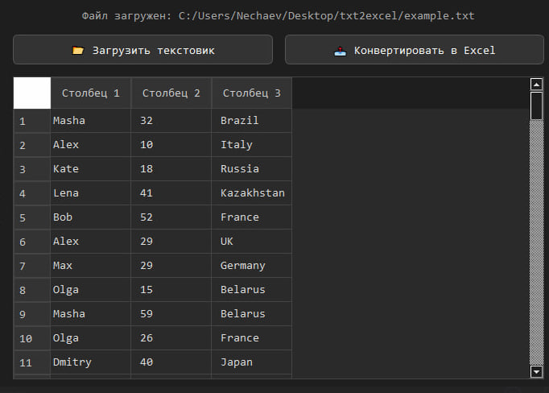

# Text2Excel Converter 

A simple and stylish desktop tool built with **Python + PyQt6** to convert `.txt` files into formatted Excel spreadsheets.

---

## Features

- 🔍 Automatic delimiter detection (`tab`, `comma`, `semicolon`, etc.)
- 📋 Preview loaded data in a clean table view
- 🖊 Rename column headers before export
- ⚙ Converts uneven row lengths without crashing
- 🌙 Dark mode UI (aesthetic and eye-friendly)

---

## Installation

1. Clone the repo:
   ```bash
   git clone https://github.com/your-username/text2excel.git
   cd text2excel

2. Install dependencies:
    ```bash
   pip install -r requirements.txt

3. Run the app:
    ```bash
    python main.py

## Pics:




## Планы:

Реализовать объединение двух текстовиком;
drag&drop;
Подтягивание названия файл при сохранении.
